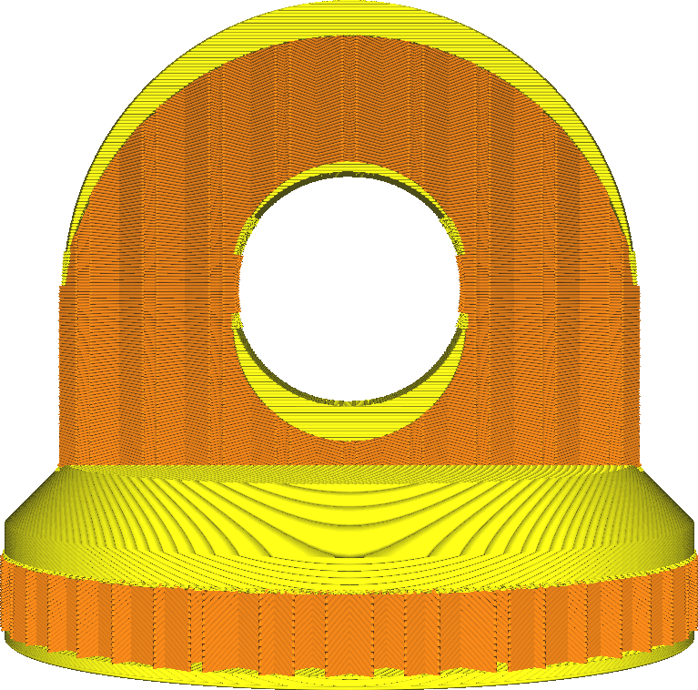

Couches supérieures
====
Ce paramètre permet de configurer le nombre de couches solides imprimées sur la face supérieure de l'impression. Ces couches solides sont imprimées à la place du remplissage. Elles sont destinées à fermer la face supérieure.

Un plus grand nombre de couches supérieures aura plusieurs effets, bénéfiques pour la qualité de la surface supérieure mais préjudiciables à la productivité.
* Votre pièce sera plus solide. Plus de couches supérieures signifie qu'une plus petite partie de votre impression sera remplie par le motif de remplissage partiel. Au lieu de cela, elle sera rendue complètement solide.
* La surface supérieure sera plus lisse. Les coussins et les affaissements de la peau supérieure seront aplanis dans les couches supérieures.
* Il est plus probable que votre modèle soit étanche. Plus de couches sur la face supérieure pourront empêcher l'eau ou d'autres fluides de pénétrer, car plus de couches sont remplies complètement.
* Votre impression utilisera plus de matière, car plus de couches sont remplies complètement.
* Votre impression prendra plus de temps, car il faut placer plus de matériau et ces couches sont normalement imprimées plus lentement que le remplissage.
